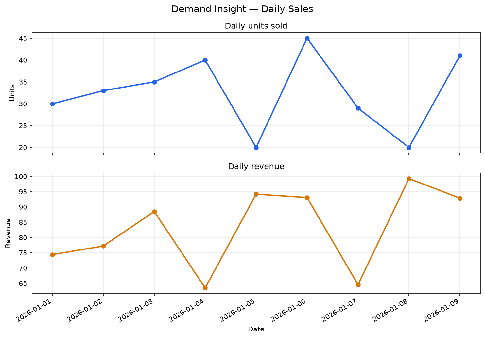
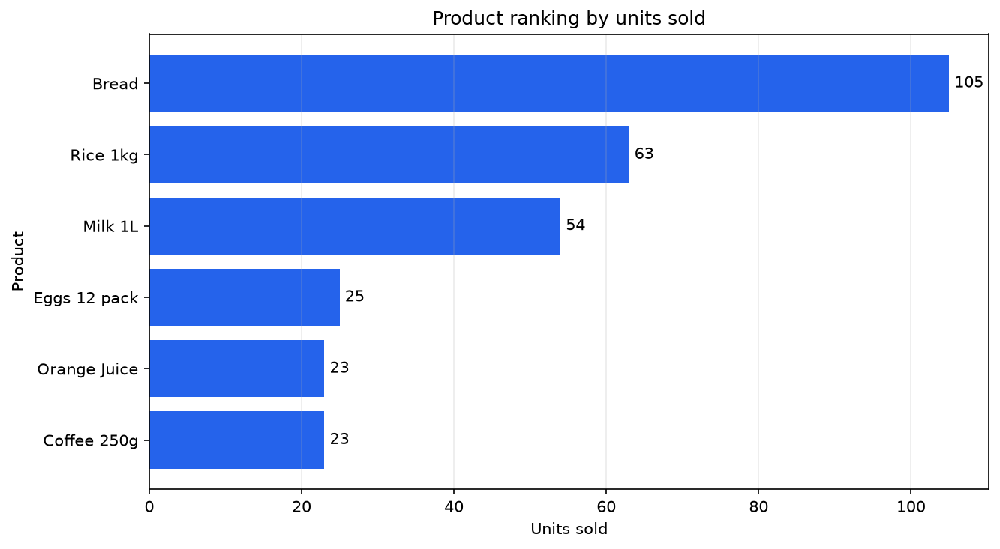
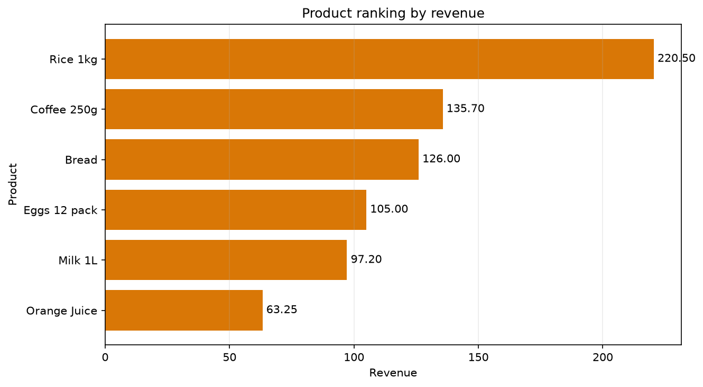

# Demand Insight Visual Report

## Objective

Present validated sales signals through reusable visual artifacts.

## Daily sales

- Units leader: 2026-01-06 — 45 unidades.
- Revenue leader: 2026-01-08 — 99.30.
- Interpretation: Esta fecha generó el mayor revenue diario observado y no coincidió con el día de mayor volumen.

## Product ranking by units

- Leader: Bread — 105 unidades.
- Interpretation: Este producto concentró el mayor volumen de unidades vendidas en el periodo observado.

## Product ranking by revenue

- Leader: Rice 1kg — 220.50.
- Interpretation: Este producto generó el mayor valor económico observado, aunque no lideró en unidades.

## Reading rule

Units sold represent demand volume.

Revenue represents observed economic value.

They must not be interpreted as the same magnitude.

## Limitation

Describe únicamente las ventas observadas entre 2026-01-01 y 2026-01-09; no predice demanda futura.

These figures describe observed data and do not demonstrate trend, seasonality or future demand.
