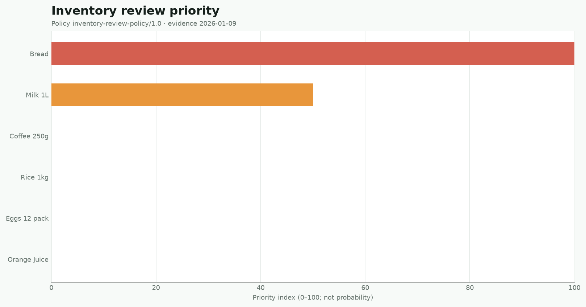
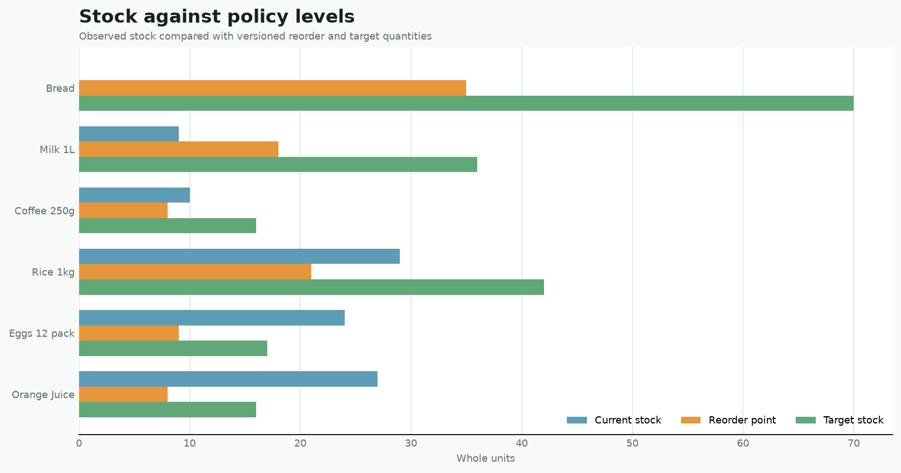
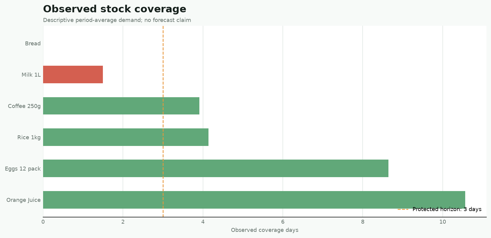

# Inventory Decision Visual Report

Evidence date: `2026-01-09`  
Policy: `inventory-review-policy/1.0`

## Priority Index

Bread and Milk 1L lead the human review queue.

## Stock Policy Levels

Current stock is shown separately from reorder and target policy levels.

## Coverage Days

Observed coverage uses descriptive demand and the three-day protected horizon.

## Interpretation boundary

Figures visualize the canonical report. Priority is not probability, observed demand is not a forecast, and suggested quantities require human review.
